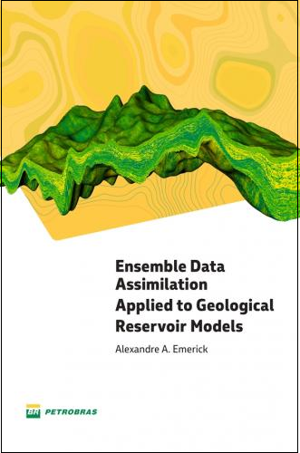

# ensemble-data-assimilation-book
# Ensemble Data Assimilation Applied to Geological Reservoir Models

**Author**: Alexandre A. Emerick  
**Publisher**: Petrobras  
**Year**: 2025  
**ISBN**: 978-6588763292  

📄 [Download the PDF](https://publicacoesup.petrobras.com.br/peld/catalog/book/54)

## About the Book

*Ensemble Data Assimilation Applied to Geological Reservoir Models* offers an in-depth examination of ensemble-based data assimilation methods for the numerical modeling of geological reservoirs. Grounded in a Bayesian framework, the book emphasizes the integration of prior geological knowledge with dynamic data to improve model predictions.

A central focus is on iterative ensemble smoothers, particularly the Ensemble Smoother with Multiple Data Assimilation (ES-MDA), which has demonstrated effectiveness in real-world applications. The methods are presented with a balance of theoretical rigor and practical insights, featuring pseudo-codes and case studies that bridge theory and practice.

### Contents

1. Introduction
- Geological Reservoirs
- Reservoir Models
- Uncertainty
- Forward Problem 
- Inverse Problem
- Bayesian Viewpoint 
- Ensembles 

2. Bayesian Formulation of the Data Assimilation Problem
- Introduction
- Model Likelihood
- Maximum a Posteriori
- Data Assimilation as a Sampling Problem
- Normalized Objective Function

3 Optimization Methods for Data Assimilation
- Introduction
- Derivative-Based Methods
- Stochastic Optimization Methods
- Other Derivative-Free Optimization Methods
- Methods Based on Proxy Modeling
- Sensitivity Analysis
- Parametrization

4 Ensemble Kalman Filter
- Introduction
- Kalman Filter
- Ensemble Kalman Filter

5 Ensemble Smoother with Multiple Data Assimilation
- Introduction
- Ensemble Smoother
- Ensemble Smoother with Multiple Data Assimilation

6 Iterative Ensemble Smoothers
- Introduction
- Ensemble Randomized Maximum Likelihood
- Subspace Iterative Ensemble Smoother

7 Sampling Errors and Rank Deficiency
- Introduction
- Rank Deficiency
- Spurious Correlations
- Covariance Inflation
- Localization

8 Computational Implementation of the Analysis
- Introduction
- Analysis in Matrix Form
- Inversion
- Matrix Multiplications

9 Practical Aspects and Field Examples
- Introduction
- Parametrization
- Observed Data
- Results Evaluation
- Field Examples
- Representative Models

A. Elements of Linear Algebra

B. Elements of Linear Inverse Problems

C. Elements of Probability and Geostatistics

D. Brief Literature Review

### Intended Audience
This book is aimed at researchers, students, and practitioners involved in:
- Reservoir characterization and history matching  
- Geological modeling  
- Subsurface monitoring and forecasting  
- Data assimilation in energy and environmental systems  

## Citation

If you use this book in your research or teaching, please cite it as:

> Emerick, A. A. (2025). *Ensemble Data Assimilation Applied to Geological Reservoir Models*. Petrobras. ISBN: 978-6588763292. [Link](https://publicacoesup.petrobras.com.br/peld/catalog/book/54)

Or use the citation metadata from the [CITATION.cff](./CITATION.cff) file in this repository.

---

For feedback, suggestions, or contributions, feel free to open an issue or pull request.
